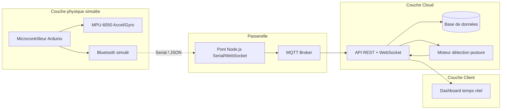

# Diagramme de flux de données – SmartPosture / CorpSafe v1

Ce document décrit le cycle de vie complet de la donnée, de la capture sur le capteur jusqu’à l’affichage dans l’interface utilisateur.

## Vue d’ensemble

## Étapes du cycle de vie

1. **Capture**  
   Le microcontrôleur (Arduino simulé) lit l’accéléromètre et le gyroscope (MPU-6050 ou données simulées). Les valeurs sont converties en unités physiques (g pour l’accélération, °/s pour la vitesse angulaire).

2. **Formatage et envoi (embarqué)**  
   À intervalle fixe (ex. 5 Hz), le firmware produit une ligne JSON contenant `accel`, `gyro` et `ts` (timestamp), puis l’envoie sur le port série (Serial Monitor du simulateur).

3. **Passerelle**  
   Un pont Node.js reçoit les données soit depuis le port série (mode Serial), soit depuis un générateur (mode mock), soit via WebSocket (Wokwi). Il valide le JSON et envoie chaque échantillon au backend : en HTTP POST vers `/api/telemetry` ou en publication MQTT sur un topic dédié.

4. **Ingestion backend**  
   L’API REST reçoit la trame (ou le subscriber MQTT la transmet au même traitement). La trame est enregistrée en base (table `telemetry`) et transmise au moteur de détection.

5. **Détection de posture**  
   Le moteur calcule les angles d’inclinaison (avant/arrière, latérale) à partir des composantes accéléromètre, applique des seuils (warning / alert) et une durée maintenue. En cas d’alerte, un événement est enregistré (`posture_events`) et diffusé.

6. **Diffusion temps réel**  
   Le serveur WebSocket envoie à tous les clients connectés chaque mise à jour de posture et chaque alerte (`posture`, `posture_alert`).

7. **Affichage (client)**  
   Le dashboard (React) est abonné au WebSocket. Il affiche la posture actuelle (OK / Attention / Alerte), la liste des alertes récentes et, optionnellement, un graphique d’évolution des angles dans le temps.
